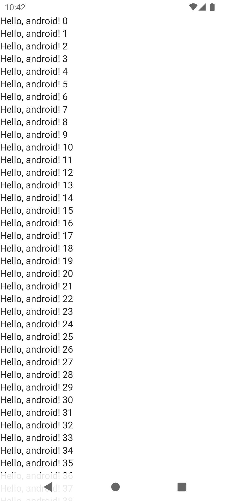
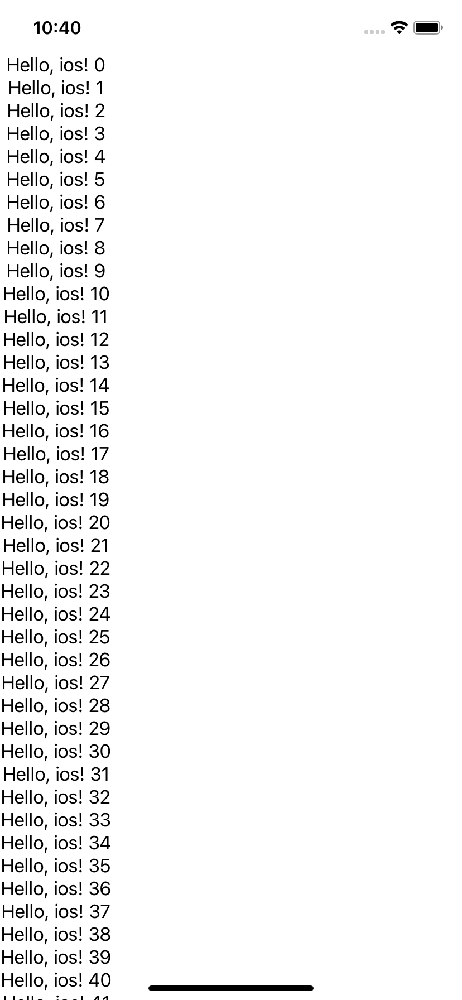
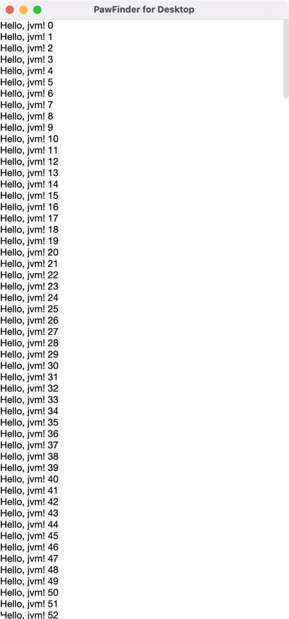
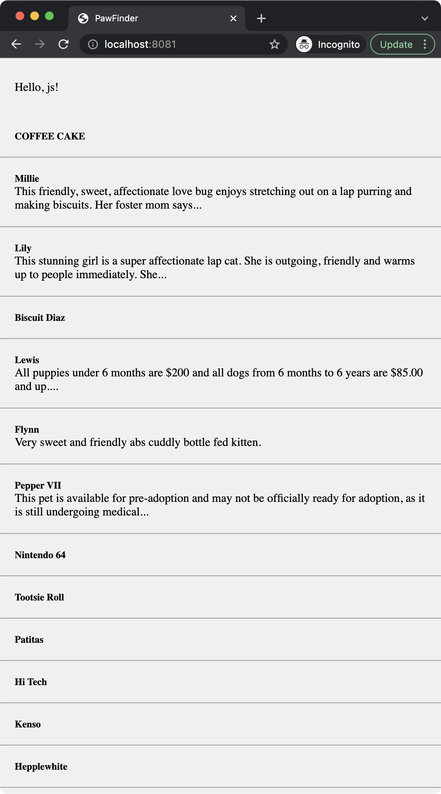

## A repository to play around with KMP

### Current implementations include:

|                 🤖 Android                 |                 🍎 iOS                 |              🖥 Desktop with compose               |              🕸 Web with react               |
|:------------------------------------------:|:--------------------------------------:|:--------------------------------------------------:|:--------------------------------------------:|
|  |  |  |  |

All sharing the same [shared](./shared) module where the common logic is written in Kotlin
